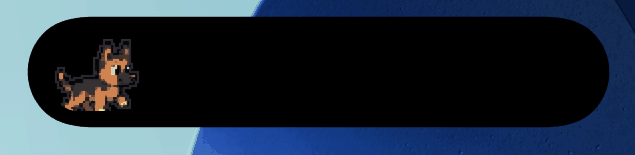
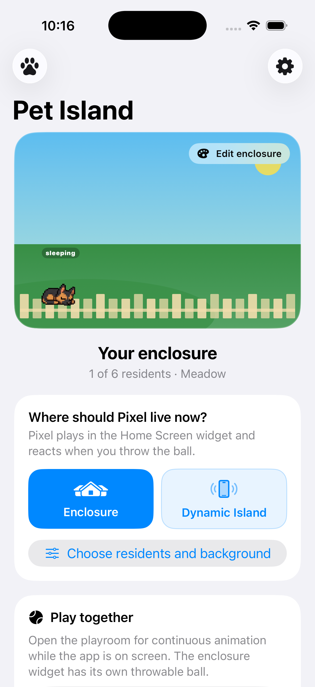

# Pet Island

<p align="center">
  
</p>

<p align="center"><sub>Shepherd, parrot, and cat — actual Dynamic Island output captured in the iOS Simulator, not a mockup.</sub></p>

Pet Island is an open-source iOS app that brings original pixel pets to the
Home Screen, Dynamic Island, Lock Screen, and an interactive in-app playroom.
It is inspired by the playful idea behind
[vscode-pets](https://github.com/tonybaloney/vscode-pets), while the iOS
architecture, interface, and original Pet Island characters are implemented
specifically for Apple platforms.

> **Project status: alpha.** The app and extensions build, the core pet
> collection and habitat are implemented, but the product is not ready for an
> App Store release yet. Real-device QA, accessibility review, and the final
> WidgetKit interaction design are still in progress.



## Current features

- A pixel-pet collection with names, colors, personalities, and visual variants.
- Dogs: German shepherd, corgi, Doberman, and bull terrier.
- Cats: classic, British shorthair, Maine coon, and Siamese.
- Red and arctic foxes.
- Classic parrot, cockatiel, budgie, and macaw.
- Classic and rockhopper penguins, plus bear, lizard, and bunny characters.
- A configurable enclosure with up to six residents and five background themes.
- A full-screen playroom where animation can run continuously while the app is open.
- A medium Home Screen widget backed by shared App Group state.
- A Live Activity for Dynamic Island and the Lock Screen with one lead pet.
- A sleeping presentation for stale or reduced-luminance/Always-On states.
- English and Russian localization.
- Local-only persistence: no account, ads, analytics, or backend service.

## How the surfaces are designed

| Surface | Purpose | Animation model |
| --- | --- | --- |
| iOS app | Collection, habitat editing, and play | Real-time SwiftUI animation while the app is open |
| Home Screen widget | A glanceable enclosure and quick pet interactions | Polished transitions between persisted moments |
| Dynamic Island | One companion and short reactions | Two-frame timer pose cycle with a sleeping fallback |
| Always-On Display | Calm ambient presence | Static sleeping pose |

### Why the widget is not a tiny game engine

WidgetKit does not keep the extension running while a widget is visible. The
extension creates timeline entries, iOS archives their views, and a system
process renders those archived representations. As a result, continuous sprite
animation, video, a game loop, or a reliable 10-second run cannot be implemented
inside a Home Screen widget.

The current product direction is therefore **Pet Moments**: tapping an action
such as pet, feed, or throw ball changes the saved scene and produces a short,
intentional system animation. For example, throwing the ball can transition
from an alert pose to the pet holding the ball and finally to a happy resting
pose. Tapping **Play** opens the matching enclosure in the app, where movement,
physics, and multi-frame running are unrestricted. This avoids presenting a
single sprite sliding across the widget as if it were running.

The compact Dynamic Island view uses a public system timer rendered with an
original Pet Island sprite font. The timer itself becomes the pet: its final
digit alternates two movement poses for seven seconds, then selects a sleeping
pose for three seconds. The timer's other glyphs are clipped, so the island
contains only one 32-point pet and no trailing status icon. This path avoids
private clock APIs. Automatic frame changes after the app is closed are verified
in the iOS 26.5 Simulator; physical-device/AOD QA is still required before an
App Store release.

Apple references:

- [Bring widgets to life (WWDC23)](https://developer.apple.com/videos/play/wwdc2023/10028/)
- [Animating data updates in widgets and Live Activities](https://developer.apple.com/documentation/widgetkit/animating-data-updates-in-widgets-and-live-activities)
- [Emoji Rangers sample](https://developer.apple.com/documentation/widgetkit/emoji-rangers-supporting-live-activities-interactivity-and-animations)

## Requirements

- macOS with a current Xcode installation.
- iOS 17.0 or newer (the project deployment target is iOS 17).
- An iPhone or iOS Simulator for the main app and Home Screen widget.
- An iPhone with Dynamic Island, or a matching Simulator, for the compact and
  expanded Dynamic Island presentations.
- A compatible physical iPhone for Always-On Display testing.

## Getting started

1. Clone the repository and open `PetIsland.xcodeproj`.
2. In Xcode's scheme picker, select **PetIsland** — not
   `PetIslandLiveActivity`.
3. Open the project settings and select the **PetIsland** target.
4. Under **Signing & Capabilities**, choose your Apple development team and
   replace `org.bortongo.PetIsland` with a unique bundle identifier.
5. Repeat for **PetIslandLiveActivity**. Its identifier must be different, for
   example `com.yourname.PetIsland.LiveActivity`.
6. Create an App Group such as `group.com.yourname.PetIsland` and assign the
   exact same group to both targets.
7. Replace the existing App Group identifier in these three files:
   - `PetIsland/PetIsland.entitlements`
   - `PetIslandLiveActivity/PetIslandLiveActivity.entitlements`
   - `PetIsland/Shared/PetLifeState.swift`
8. Select a Simulator or connected iPhone and press **Run** (`Command-R`).

The main application embeds the widget/Live Activity extension, so you should
normally run only the `PetIsland` scheme. Running the extension scheme directly
asks Xcode to preview a widget and is not the normal app launch path.

For a detailed Russian-language Xcode walkthrough, see
[XCODE_GUIDE_RU.md](XCODE_GUIDE_RU.md).

For a file-by-file explanation of the Swift architecture and a Swift glossary
for C++/Qt/Python developers, see [CODE_GUIDE_RU.md](CODE_GUIDE_RU.md).

## Testing the Home Screen widget

1. Run Pet Island once and configure at least one enclosure resident.
2. Return to the Home Screen.
3. Long-press an empty area and choose **Edit** → **Add Widget**.
4. Search for **Pet Island**, select the medium widget, and add it.

iOS does not allow an app to place its own widget automatically. If Pet Island
does not appear in the gallery, confirm that the main app was installed, the
extension is embedded, and both targets use the same Team and App Group.

## Testing Dynamic Island

1. Run the main `PetIsland` scheme on a compatible device or Simulator.
2. Choose a lead pet and place it in **Dynamic Island** from the app.
3. Go to the Home Screen to see the compact presentation.
4. Long-press the island to inspect the expanded presentation and actions.
5. On a compatible physical device, lock the phone to verify the sleeping
   Always-On presentation.

On an iPhone without Dynamic Island, the same Live Activity appears on the Lock
Screen instead.

## Repository layout

```text
PetIsland/                 Main SwiftUI application
  App/                     App lifecycle and session controller
  Data/                    Local persistence
  Domain/                  Pet models and behavior
  Features/                Collection, habitat, and playroom screens
  Shared/                  Models shared with the extension
PetIslandLiveActivity/     Home Screen widget and Live Activity
PetIslandTests/            Unit tests
SharedResources/           Shared sprite asset catalog
Design/                    Source art, previews, and asset tools
Scripts/                   Asset import/build utilities
```

## Development status and roadmap

Completed foundations:

- [x] SwiftUI application and shared widget extension
- [x] App Group persistence
- [x] Multi-pet collection and visual variants
- [x] Configurable six-resident habitat
- [x] Dynamic Island/Lock Screen Live Activity
- [x] Unit tests for domain and habitat state

Before the first public release:

- [ ] Replace experimental widget locomotion with the Pet Moments interaction model
- [ ] Finish real-time playroom behavior and ball physics
- [ ] Perform real-device testing for widget, Dynamic Island, and Always-On Display
- [ ] Complete VoiceOver, Dynamic Type, Reduce Motion, and localization QA
- [ ] Audit every bundled sprite and third-party notice before App Store submission
- [ ] Add screenshots, App Store metadata, and a TestFlight release checklist

Detailed planning lives in [ROADMAP.md](ROADMAP.md), the latest manual checkpoint
is in [CHECKPOINT.md](CHECKPOINT.md), and known platform constraints are tracked
in [KNOWN_ISSUES.md](KNOWN_ISSUES.md).

## Inspiration and attribution

Pet Island is inspired by `vscode-pets`, but it is not intended to be a direct
port. Pet behavior concepts are adapted to native Swift and the iOS lifecycle.
Some specifically identified third-party sprite frames may be included under
their original terms; all such material must remain documented in
[THIRD_PARTY_NOTICES.md](THIRD_PARTY_NOTICES.md).

Do not assume that a repository's source-code license automatically covers every
image in that repository. New Pet Island characters should use original artwork
unless the exact asset license and attribution have been verified.

## Contributing

Issues and pull requests are welcome while the project is in alpha. Please keep
platform constraints explicit, add tests for behavior/state changes, and document
the origin and license of every new visual asset.

## License

Pet Island source code is released under the [MIT License](LICENSE). Third-party
materials, where present, retain their own notices and terms as listed in
[THIRD_PARTY_NOTICES.md](THIRD_PARTY_NOTICES.md).
