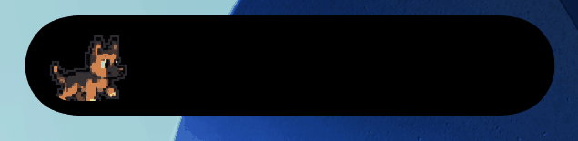
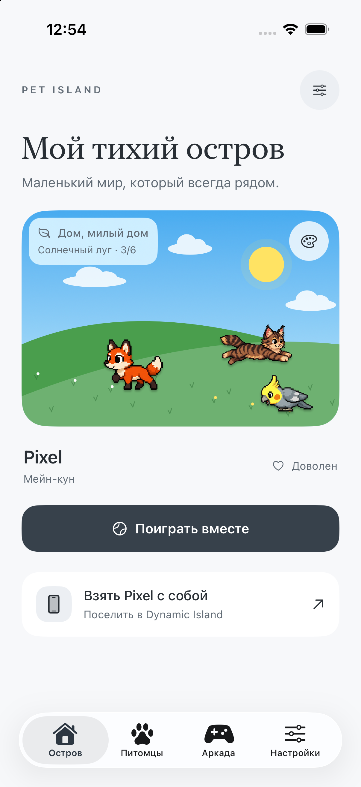
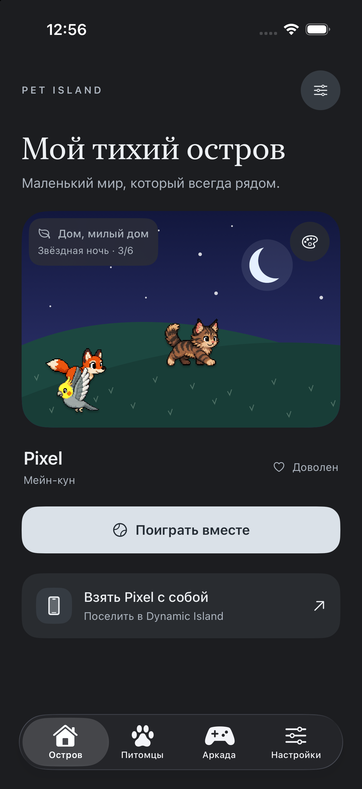
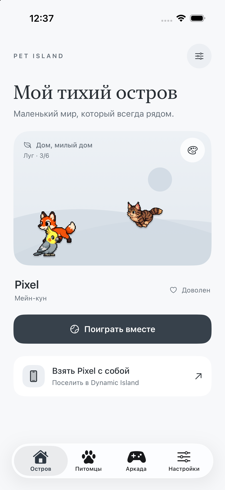
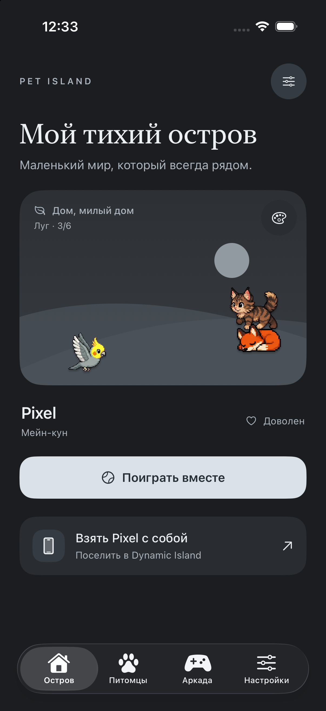
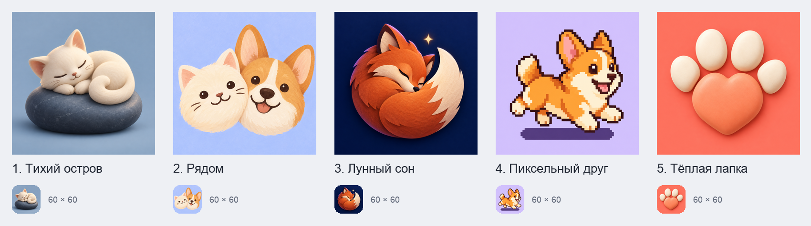

# Pet Island

Pet Island is an independent personal iOS project: a small island for pixel
companions, with an interactive enclosure, three arcade games, a Home Screen
widget, and a pet that accompanies you in Dynamic Island and on the Lock Screen.

The app works locally, without an account, a backend, analytics, or advertising.
The interface is available in English and Russian.

> **Status: active development, ready for iPhone testing.** The latest verified
> build passed 138 tests, a Release build, and static analysis on September 24,
> 2026. Simulator checks cover the main flows; physical-device and accessibility
> testing are still part of the work before a public release.

<p align="center">
  
</p>

<p align="center"><sub>Dynamic Island footage recorded in the iOS Simulator.</sub></p>

## Pets and their island

The collection contains **20 visual variants across six species**:

| Species | Available variants |
| --- | --- |
| Dogs | German shepherd, Pembroke corgi, Cardigan corgi, Doberman, bull terrier |
| Cats | Classic cat, British shorthair, Maine coon, Siamese |
| Foxes | Red fox, arctic fox |
| Parrots | Classic parrot, cockatiel, budgie, macaw |
| Penguins | Classic penguin, rockhopper |
| Lions | Adult male lion, lioness, lion cub |

- Give pets names, choose their variants and coats, or set a custom color.
- The Corgi card offers Pembroke and Cardigan variants, followed by the same
  text-based coat selector used for other pets.
- Keep up to **six residents** in the enclosure and choose from **ten scenes**:
  five calm environments and five vivid alternatives, including a sunny meadow,
  a starry night, a warm room, a snowy cove, and sunset dunes.
- Pet your companions and open the full-screen playroom to throw a ball and
  play fetch. Grounded movement and gait frames follow the distance travelled.
- Track fullness, happiness, and energy, with rest and care between games.

<p align="center">
  
  
</p>

## Arcade

Three games share your pet collection and local progress:

| Game | Play |
| --- | --- |
| Pets Dash | Run along an island trail, change lanes, jump over obstacles, and collect coins |
| Sky Paws | Flap through gaps between clouds |
| Sky Hop | Jump between floating platforms and climb higher |

Games include records, coin rewards, pause/resume, and a local shop with food,
treats, toys, and vitamins. The shop uses earned in-game coins; it does not make
real-money purchases. Backgrounding a game pauses the action.

## Appearance

The **Quiet Island** interface has a graphite dark theme, a gentle light theme,
and a system-following option. Haptics and reduced pet motion are configurable.

<p align="center">
  
  
</p>

The original app icon remains the default. **Settings → App icon** offers it
alongside five alternatives: Quiet Island, Together, Moon nap, Pixel friend,
and Warm paw. Selecting one changes the actual Home Screen icon; the original
can be restored at any time.

<p align="center">
  
</p>

## Dynamic Island and Lock Screen

Take one pet from the island with you in a Live Activity. The compact and
minimal Dynamic Island presentations show the pet; the expanded presentation
also provides short run and play interactions.

In **Island → Island setup** you can choose:

- **Pet mode:** run, walk, sleep, run + sleep, walk + sleep, or run + walk + sleep.
- **Time on the island:** 20 minutes, 40 minutes, 1 hour, 2 hours, or 4 hours.
- **Card color:** five presets or any custom color, with a preview and a reset
  to the default background. Text contrast adjusts automatically.

Saving a card color updates the current Live Activity and future sessions.
Changing the movement mode or duration takes effect on the next session.
The card color applies to the **Lock Screen only**: Dynamic Island has no added
colored outline. On an iPhone without Dynamic Island, the Live Activity is
still available on the Lock Screen.

The system presentations use registered pet artwork and timer fonts with
consistent sizing and ground alignment. iOS controls their rendering and update
opportunities; they do not run the app's continuous animation loop. The pet
rests when the activity becomes stale or the display enters its reduced-luminance
Always-On state.

## Home Screen widget

The medium enclosure widget shares residents, background, and care state with
the app through an App Group. It displays timeline snapshots and short care
reactions. **Play** opens the interactive playroom in the app.

To add it, launch Pet Island once, choose enclosure residents, then open the
Home Screen widget gallery and select **Pet Island → Enclosure**. The app cannot
place a widget on the Home Screen automatically.

## Build and run

### Requirements

- macOS and Xcode with an installed iOS Simulator runtime.
- iOS **17.0 or later**; recent simulator verification used **iOS 26.5**.
- A compatible iPhone or simulator for Dynamic Island testing, and a physical
  iPhone with Always-On Display to verify that behaviour on hardware.
- No external package dependencies are required to build the iOS app.

### Xcode

1. Open `PetIsland.xcodeproj` and select the **PetIsland** scheme.
2. Choose an iPhone simulator, or connect an iPhone and select it as the destination.
3. For a physical device, select your development team under **Signing &
   Capabilities** for both `PetIsland` and `PetIslandLiveActivity`.
4. Confirm that both targets have access to the same App Group.
5. Run with **Command-R**.

The project currently uses these identifiers:

| Target / capability | Identifier |
| --- | --- |
| Main app | `org.bortongo.PetIsland` |
| Widget and Live Activity extension | `org.bortongo.PetIsland.LiveActivity` |
| Shared App Group | `group.org.bortongo.PetIsland` |

If signing with another team, use identifiers available to that team. Update
the App Group in both entitlement files and in
`PetIsland/Shared/PetLifeState.swift` together.

The main app embeds the extension. Run the **PetIsland** scheme for normal
testing; launching the extension scheme directly opens a widget preview flow.

## Check the current features on iPhone

1. Add pets, switch between the two corgi variants, and try coats and custom colors.
2. Change the enclosure residents and scene; open the playroom and throw the ball.
3. Start each arcade, pause it, background the app, and return to the game.
4. Take a pet to Dynamic Island, inspect the compact and expanded views, and
   check the Lock Screen with the display awake and in Always-On mode.
5. Open **Island → Island setup → Card color**, save a light or dark color, and
   verify the active Lock Screen card. Try resetting it to the default.
6. Open **Settings → App icon**, choose an alternative, check it on the Home
   Screen, and switch back to the original.
7. Add the enclosure widget and check that resident and scene changes reach it.

In Russian, the new settings are **Остров → Настройка острова → Цвет карточки**
and **Настройки → Иконка приложения**.

## Tests and validation

Run the **PetIsland** test action with **Command-U** in Xcode. The latest verified
suite has **138 passing tests**, including save recovery, pet placement, arcade
rules, movement geometry, sprite registration, Live Activity color persistence
and contrast, and alternate-icon configuration.

For the full automated check, install the Python tooling dependencies and run:

```sh
python3 -m venv .venv
. .venv/bin/activate
python -m pip install -r Tools/requirements-dev.txt
bash Tools/check_project.sh
```

The script validates timer fonts, natural gaits, and the bundled lion/Cardigan frames;
then runs the simulator tests, a Release build, and static analysis. Reports go
to `outputs/qa/`. Set `PET_TEST_DESTINATION` to select a particular simulator,
`PET_PYTHON` to choose a Python interpreter, or `PET_REPORT_DIR` to choose a new
report directory. Pillow and fontTools are development-only dependencies.

These checks use only committed application resources and do not require artwork
drafts or generation tools. Automated and simulator checks do not replace
physical-device coverage, complete VoiceOver and Dynamic Type checks,
minimum-supported-iOS testing, or performance measurements.

## Project structure

```text
PetIsland/
  App/                     App lifecycle and session controller
  Data/                    Local saves and recovery
  Domain/                  Pet, care, and arcade rules
  Features/                Island, collection, playroom, games, and settings
  Shared/                  Shared models, artwork, and Live Activity payloads
  Assets.xcassets/         App assets, default and alternate icons
PetIslandLiveActivity/     Home Screen widget and Live Activity extension
PetIslandTests/            Automated tests
SharedResources/          Sprite catalog shared with the extension
Docs/Media/               Screenshots and illustrations used by the README
Tools/                    Resource validation and automated build checks
```

## Further development

The next focus is device testing and polishing the existing pet, enclosure, and
arcade experience. Pet habits, cozy objects, island finds, postcards, and a future
way to support the author are ideas for later, not current features.

## License

The project's source code is licensed under the [MIT License](LICENSE).
